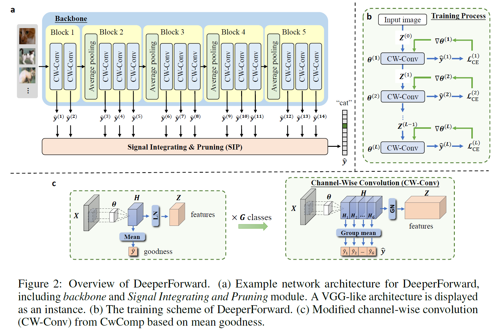
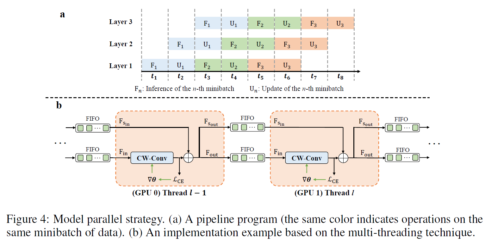
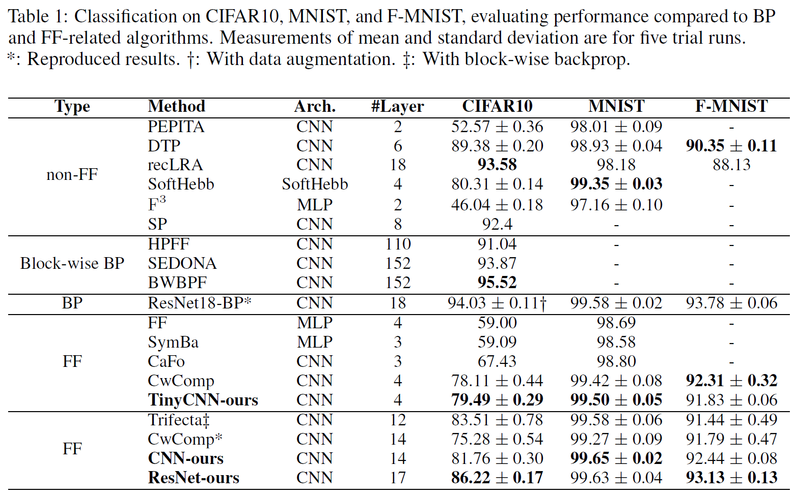

# DeeperForward: Enhanced Forward-Forward Training for Deeper and Better Performance

## Abstact

While backpropagation effectively trains models, it presents challenges related to bio-plausibility, resulting in high memory demands and limited parallelism. Recently, Hinton (2022) proposed the Forward-Forward (FF) algorithm for high-parallel local updates. FF leverages squared sums as the local update target, termed goodness, and employs L2 normalization to decouple goodness and extract new features. However, this design encounters issues with feature scaling and deactivated neurons, limiting its application mainly to shallow networks. This paper proposes a novel goodness design utilizing **layer normalization** and **mean goodness** to overcome these challenges, demonstrating performance improvements even in 17-layer CNNs. Experiments on CIFAR-10, MNIST, and Fashion-MNIST show significant advantages over existing FF-based algorithms, highlighting the potential of FF in deep models.
Furthermore, the model parallel strategy is proposed to achieve highly efficient training based on the property of local updates.

## Overview

<div align=center>

</div>

## Model Parallel Strategy 

<div align=center>

</div>

## Installation

Test on CUDA 12.2, PyTorch 2.3.0

```setup
conda create -n deeperforward python=3.11.7
conda activate deeperforward
pip install torch==2.3.0 torchvision==0.18.0 --index-url https://download.pytorch.org/whl/cu121
pip install -r requirements.txt
```

## Training

To train the model(s) on CIFAR10 in the paper, run this command, using 1 GPUs:

```train
python main.py --data_dir <path_to_data> --task cifar10 --arch resnet --devices 0
```

To train the model(s) using 2 GPUs with model parallel strategy in the paper, run this command:

```train parallel
python main.py --data_dir <path_to_data> --task cifar10 --arch resnet --task_dir resnet-cifar10 --devices 0 1 --parallel
```
You can select model by changing the `--arch` argument. The available models are: `resnet`, `vgg`, `tinycnn`. Also, you can select dataset by changing the `--task` argument. The available datasets are: `cifar10`, `mnist`, `fmnist`.

## Evaluation

To evaluate my model on CIFAR10 after training, run:

```eval
python test.py --data_dir <path_to_data> --task cifar10 --arch resnet --task_dir resnet-cifar10 --devices 0
```

## Main Results

Our model achieves the following performance:

| Model name | #layer | CIFAR10 | MNIST | F-MNIST |
|------------|--------|-------|---------|---------|
| ResNet     | 17     | 86.22 ± 0.17  | 99.63 ± 0.04    | 93.13 ± 0.13 |
| CNN        | 14     | 81.76 ± 0.30  | 99.65 ± 0.02    | 92.44 ± 0.08 |
| TinyCNN    | 4      | 79.49 ± 0.29  | 99.50 ± 0.05    | 91.83 ± 0.06 |

<div align=center>

</div>

## ✏️ Citation
If you find this paper useful, please consider staring 🌟 this repo and citing 📑 our paper:
```
@inproceedings{sun2025deeperforward,
  title={DeeperForward: Enhanced Forward-Forward Training for Deeper and Better Performance},
  author={Sun, Liang and Zhang, Yang and Wen, Jiajun and Shen, Linlin and Xie, Weicheng and He, Weizhao},
  booktitle={International Conference on Learning Representations},
  year={2025}
}
```